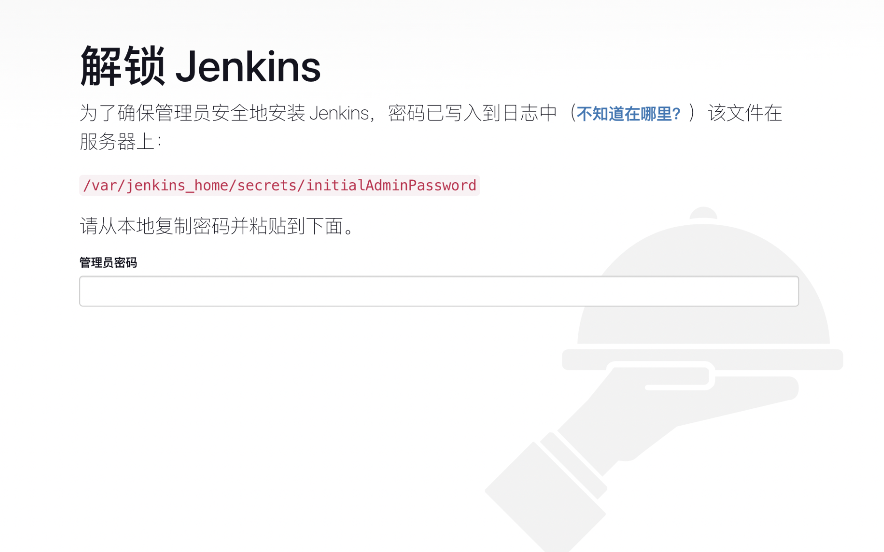
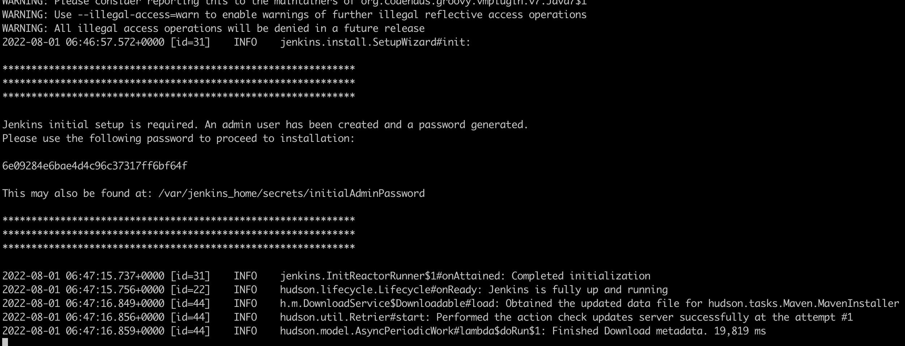

## Jenkins的安装
```
# 拉取镜像
docker pull jenkins/jenkins
# 查看镜像
docker images
docker image ls
# 创建挂载文件夹，并且进行文件权限授予
#创建文件夹
mkdir -p /home/jenkins_home
#权限
chmod 777 /home/jenkins_home
# 启动Jenkins
docker run -d -uroot -p 9524:8080 -p 50000:50000 --name jenkins --restart=always -v /home/jenkins_home:/var/jenkins_home -v /etc/localtime:/etc/localtime -v /var/run/docker.sock:/var/run/docker.sock -v /var/run/docker.sock:/var/run/docker.sock -v /usr/bin/docker:/usr/bin/docker -v /etc/docker:/etc/docker jenkins/jenkins
# 如果刚开始忘记加是否自动重启，使用下面的命令作为补充
docker container update --restart=always 容器的名字

```
> Jenkins启动命令的具体说明如下


| 命令                                    | 描述                                                         |
| --------------------------------------- | ------------------------------------------------------------ |
| -d                                      | 后台运行容器，并返回容器ID                                   |
| -uroot                                  | 使用 root 身份进入容器，推荐加上，避免容器内执行某些命令时报权限错误 |
| -p 9524:8080                            | 将容器内8080端口映射至宿主机9524端口，这个是访问jenkins的端口 |
| -p 50000:50000                          | 将容器内50000端口映射至宿主机50000端口                       |
| --name jenkins                          | 设置容器名称为jenkins                                        |
| -v /home/jenkins_home:/var/jenkins_home | :/var/jenkins_home目录为容器jenkins工作目录，我们将硬盘上的一个目录挂载到这个位置，方便后续更新镜像后继续使用原来的工作目录 |
| -v /etc/localtime:/etc/localtime        | 让容器使用和服务器同样的时间设置                             |
| jenkins/jenkins                         | 镜像的名称，这里也可以写镜像ID                               |

## 访问Jenkins

```
# 查看正在运行的容器
docker ps
```



>  查看Jenkins的密码

```
# 进入到容器的内部
docker exec -it 容器的ID /bin/bash
# 查看密码
cat /var/jenkins_home/secrets/initialAdminPassword
# 查看指定容器的运行日志,在Jenkins初始化的时候，也可以通过此命令查看初始化密码，如下图所示
docker logs -f 容器的ID或者容器的名称
```




## Jenkins的常见问题

> 因为网络原因，需要将插件源设置为国内的，这样才可以安装插件。

```shell
# 进入宿主机目录 /home/jenkins_home/， 
cd /home/jenkins_home/
# 编辑文件 hudson.model.UpdateCenter.xml
cat hudson.model.UpdateCenter.xml
# 将下面的url地址切换成清华大学官方镜像
https://mirrors.tuna.tsinghua.edu.cn/jenkins/updates/update-center.json
# 重启容器
docker restart jenkins
```

```xml
<?xml version='1.1' encoding='UTF-8'?>
<sites>
  <site>
    <id>default</id>
    <url>https://updates.jenkins.io/update-center.json</url>
  </site>
</sites>
```

